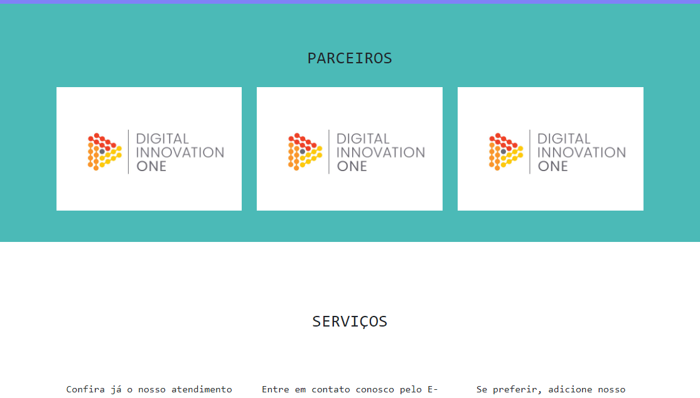
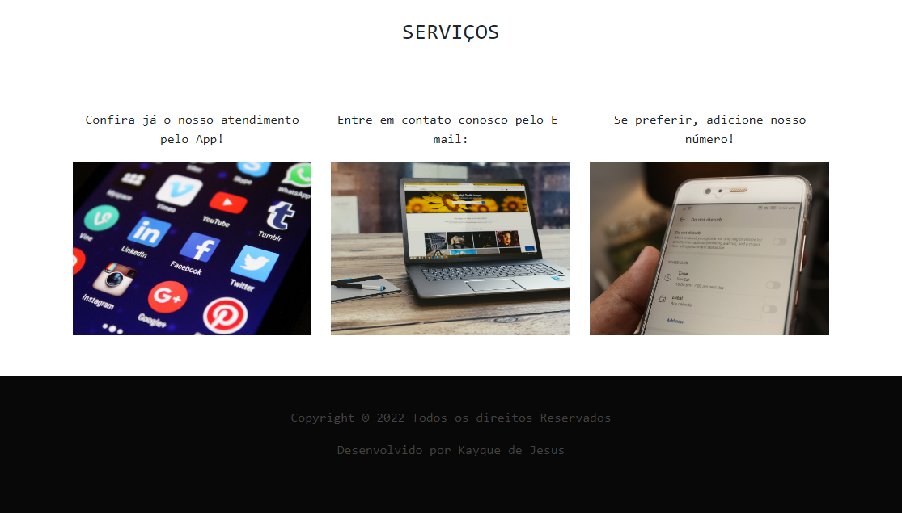

# Usando Bootstrap

>Bootstrap

Página inicial de uma empresa, utilizando Bootstrap(Completamente responsivo)

[🔗 Clique aqui para acessar a página](https://kayqueprogram.github.io/usando-bootstrap/)

## 💻 Tecnologias

- HTML5
- CSS3
- Bootstrap
- Git

## 📖 O que aprendi?

- Manipular as classes Bootstrap
- Responsividade

## ✉️ Contato

kayquejesusdn@gmail.com